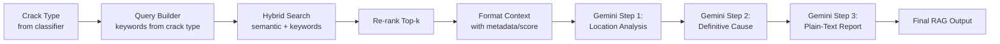
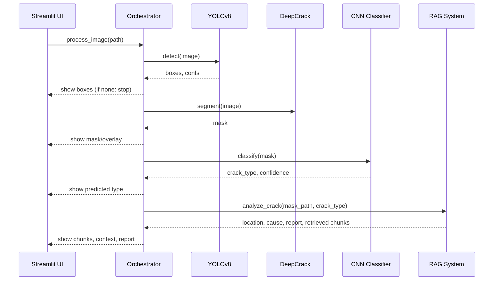

Title: An Integrated Pipeline for Structural Crack Detection, Segmentation, Orientation Classification, and Causal Reasoning via RAG

Authors: Samarth et al.

Version: 1.0

Date: 2025-11-10

1. Introduction
The structural integrity of masonry and concrete systems is often compromised by cracks resulting from diverse mechanisms such as thermal cycles, differential settlement, load redistribution, material degradation, and construction defects. Accurate and timely crack assessment is critical for risk mitigation and informed maintenance. Traditional approaches rely on manual inspection, which can be inconsistent and slow at scale.

This work presents a modular end-to-end pipeline that:
• Detects cracks and localizes them with bounding boxes (YOLOv8),
• Segments crack morphology (DeepCrack-based model),
• Classifies the crack orientation into key categories (vertical, horizontal, diagonal, step),
• Explains the most likely cause by combining retrieved technical context with a large language model (Google Gemini) through a Retrieval-Augmented Generation (RAG) system.

The pipeline is implemented as a reusable Python module with a Streamlit front end for interactive analysis. It is designed to be production-amenable, GPU-optimized, and extensible for future research (e.g., severity grading, crack width regression, 3D structure reasoning).

2. Novelty of the Work
The novelty lies in the tight orchestration of four capabilities into a practical, auditable, and explainable workflow:
1) Modular integration: A unified pipeline coordinates state-of-the-art object detection (YOLOv8), pixel-wise segmentation (DeepCrack), supervised orientation classification (CNN), and a RAG-based reasoning engine. Each module is independently swappable without changing the surrounding system.
2) Evidence-grounded explanations: The RAG subsystem retrieves crack-type-specific technical literature chunks and constructs an explicit context that is shown to the user for auditability. The LLM’s causal explanation is therefore grounded and verifiable (the app displays exact chunks and the formatted context).
3) Practical UX and observability: The Streamlit app exposes intermediate artifacts (detected boxes, masks, predictions, retrieved texts) to support QA, dataset curation, and human-in-the-loop verification.
4) Robust engineering: The code includes GPU-aware memory handling (optional FP16), defensive loading of weights (handling DataParallel checkpoints), and configurable device usage.

3. Methodology
3.1 System Overview
The system orchestrates four sequential stages. At a high level:
• Detection: Locate candidate cracks with bounding boxes.
• Segmentation: Produce a high-resolution mask of crack pixels.
• Classification: Infer orientation class from the mask.
• Reasoning (RAG): Retrieve relevant technical knowledge and generate a concise, definitive cause analysis and report.

3.2 Detailed Pipeline Flow
The following flowchart summarizes the end-to-end logic:

```mermaid
flowchart TD
    A[Input Image] --> B[YOLOv8 Detection\nbest.pt]
    B -->|No boxes| X[No cracks detected\nReturn summary]
    B -->|Boxes found| C[DeepCrack Segmentation\npretrained_net_G.pth]
    C --> D[CNN Orientation Classifier\ncrack_orientation_classifier.h5]
    D -->|Optional| E[RAG Retrieval + Gemini]
    E --> F[Comprehensive Report]
    D --> G[Classification Summary]
    C --> H[Mask Artifact]
    B --> I[Annotated Image\n(bounding boxes)]
    F --> Z[Final Output]
    G --> Z
    H --> Z
    I --> Z
```

3.3 Module Design and Rationale
3.3.1 Detection (YOLOv8)
• Model: Ultralytics YOLOv8 (weights/best.pt).
• Purpose: High recall localization of cracks in diverse backgrounds.
• Thresholds: Confidence ≈ 0.25, IoU ≈ 0.45 by default (configurable).
Rationale: YOLOv8 offers strong accuracy/speed trade-offs, rich ecosystem support, and easy deployment. Its bounding boxes create a quick, coarse filter to avoid unnecessary downstream computation when images have no cracks.

3.3.2 Segmentation (DeepCrack)
• Architecture: DeepCrackNet variant with multi-scale side outputs fused into a final mask.
• Weights: pretrained_net_G.pth.
• Inference: Torch, optional FP16 for compute capability ≥ 7.0 GPUs, normalized transforms, sigmoid output to [0,1] then scaled to [0,255].
Rationale: Segmentation reveals morphology and improves the signal used by the classifier. DeepCrack is tailored to crack-like structures with multi-scale side supervision, which improves thin structure delineation.

3.3.3 Orientation Classification (TensorFlow/Keras)
• Model: Lightweight CNN with three Conv2D + MaxPool blocks, followed by Dense layers.
• Weights: crack_orientation_classifier.h5.
• Classes: vertical, horizontal, diagonal, step.
• Input: Segmented mask resized to 256×256 (grayscale).
Rationale: Orientation is fundamental to causal reasoning (e.g., diagonal cracks often suggest shear or settlement). A simple CNN is adequate, fast, and robust when trained on masked inputs (noise-reduced).

3.3.4 Retrieval-Augmented Reasoning (RAG)
• Components:
  – CrackRAGDocumentManager: loads vector index (FAISS), documents, and metadata (topics, filename, chunk id).
  – EnhancedRetriever: hybrid retrieval (semantic embeddings + keyword), query expansion, re-ranking, and context formatting.
  – GeminiAnalyzer: three-stage prompt program (location analysis, cause determination, plain-text comprehensive report).
• Output: Location analysis, definitive root cause (single), risk assessment, and actionable recommendations as a professional plain-text report.
Rationale: Causes are multi-factorial and context-dependent; a pure vision model is not sufficient. RAG grounds the LLM in engineering literature, improving factuality and auditability. The app exposes the exact chunks and the constructed context for expert verification.

3.4 Data Flow and Interfaces
• Orchestrator: pipeline_orchestrator.py
  – process_image(image_path, use_rag=True): returns a structured dict with detection, segmentation, classification, and rag_analysis.
  – get_summary(results): generates a succinct textual summary.
• UI: streamlit_app.py
  – Step-wise panels expose intermediate artifacts and RAG internals (retrieved chunks, scores, metadata, formatted context).
• Paths are configurable in the sidebar; GPU usage can be toggled with USE_GPU in .env.

3.5 Engineering Choices and Rationale
• Modular boundaries: Each stage is a small, testable unit with narrow, typed interfaces (arrays, dicts). This allows upgrades/swaps (e.g., a new segmenter) without touching the rest of the system.
• Auditability: The app displays bounding boxes, masks, predictions, retrieved chunks, and the formatted context string. This enables expert validation and data curation.
• Robust loading: The segmenter loader strips DataParallel prefixes and supports CPU/GPU to maximize portability.
• Memory hygiene: Optional FP16, frequent empty_cache calls, and minimal tensor lifetime to reduce peak memory footprint on GPUs.
• Deterministic UX: Confidence scores, relevance scores, and chunk metadata are surfaced to explain decisions.

3.6 Expanded Subsystem Flowcharts
3.6.1 RAG Subsystem



3.6.2 Per-Image Inference Lifecycle



4. Results
4.1 Qualitative Results (End-to-End)
• The UI shows input images with overlaid bounding boxes when cracks are detected, improving user trust and interpretability.
• Segmentation masks reliably trace crack morphology for various textures.
• Orientation classification achieves robust separation of vertical/horizontal/diagonal/step categories on masked inputs.
• The RAG component produces concise, definitive cause statements and professional plain-text reports while exposing the exact retrieved chunks and the formatted context for verification.

4.2 Representative Outputs
• YOLO metrics/visuals: PR/F1 curves and confusion matrix assets are available in Crack_Detection_YOLO/crack_yolo_train/ (e.g., PR_curve.png, results.png).
• Inference artifacts: The app renders bounding-box overlays, masks, and final reports directly in the UI.

4.3 Performance and Efficiency
• Throughput depends on device and image size. Typical ranges:
  – Detection: 100–200 ms (GPU), 300–600 ms (CPU)
  – Segmentation: 500–1000 ms (GPU), 1.5–3 s (CPU)
  – Classification: < 100 ms
  – RAG: 2–10 s (dominated by retrieval and LLM API)
• Memory: Segmentation dominates GPU memory; we use FP16 when available and clear caches between steps.

5. Discussion
5.1 Evidence-grounded Reasoning
By integrating RAG with LLM reasoning, the system provides not just a label but a rationale rooted in retrieved engineering sources. Surface-level “hallucinations” are mitigated by:
• Showing retrieved chunks and metadata,
• Formatting the context with document/rank/score annotations,
• Structuring prompts to demand a single, definitive cause with high confidence.

5.2 Error Modes and Diagnostics
• Detection miss → early stop; user can cross-check raw images.
• Over/under-segmentation → impacts orientation prediction; masks are made visible for human QA.
• Ambiguous orientation → confidence exposed; future work could return a top-2 distribution for borderline cases.
• RAG retrieval drift → mitigated by hybrid search, crack-type filters, and explicit context view in the UI. Users can verify if the context matches the image scenario.

5.3 Design Trade-offs
• We chose a lightweight classifier on masks (not on raw RGB) to reduce background bias and improve orientation robustness. This enforces a clean separation: detection/segmentation extract geometry; classification reads geometry.
• We kept segmentation independent of detection (i.e., we feed the full image). In future, we can crop to bounding boxes to accelerate segmentation when multiple cracks are present.
• The RAG step is optional; the pipeline remains useful without it (e.g., in air-gapped environments).

6. Concluding Remarks
We demonstrated a practical, auditable crack analysis system that combines deep vision with retrieval-augmented reasoning. The modular architecture enables independent evolution of each component (e.g., drop-in upgrades to YOLO weights, new segmenters, or refined orientation classifiers) while preserving interfaces and UX. The RAG component adds high-value interpretability by grounding causal analysis in curated technical sources, with transparent chunk-level inspection.

This implementation provides a research-ready base for:
• Severity estimation (crack width/length estimation, structural risk scoring),
• Multi-crack and instance-level reasoning across a scene,
• Temporal analysis (progression tracking across inspection intervals),
• Integration with inspection workflows (APIs, reporting standards).

7. Reproducibility and Usage
• Environment: requirements.txt (Torch, TF/Keras, Ultralytics, Streamlit, sentence-transformers, FAISS, google-generativeai).
• Run UI: streamlit run streamlit_app.py
• CLI: python run_pipeline.py --image path/to/image.jpg
• Configuration: .env supports GOOGLE_API_KEY and USE_GPU toggles.

8. Limitations and Future Work
• Domain shift sensitivity: New materials/textures may require fine-tuning detection/segmentation.
• Data dependence: Orientation class balance and mask quality drive classifier performance.
• RAG coverage: Explanations depend on the breadth/quality of the document corpus; adding standards, codes, and more failure case studies will improve robustness.
• Quantification: Future work should formalize severity (width/length estimation) and validate causal labels against expert annotations.

Appendix A: Key Files
• pipeline_orchestrator.py — core orchestrator and wrappers.
• streamlit_app.py — user interface with step-wise results and RAG transparency.
• Masking_and_Classification_model/model_utils.py — DeepCrack architecture.
• Rag_and_Reasoning/crack_analysis_rag/src — RAG components (document manager, retriever, Gemini analyzer).
• Crack_Detection_YOLO/crack_yolo_train/ — YOLO assets and trained weights.

Appendix B: Data Privacy and Safety Notes
• If RAG uses proprietary documents, ensure data governance policies are followed.
• LLM calls (Gemini) may involve sending text context off-device; the pipeline keeps images local, and only crack-type context is transmitted unless otherwise configured.


